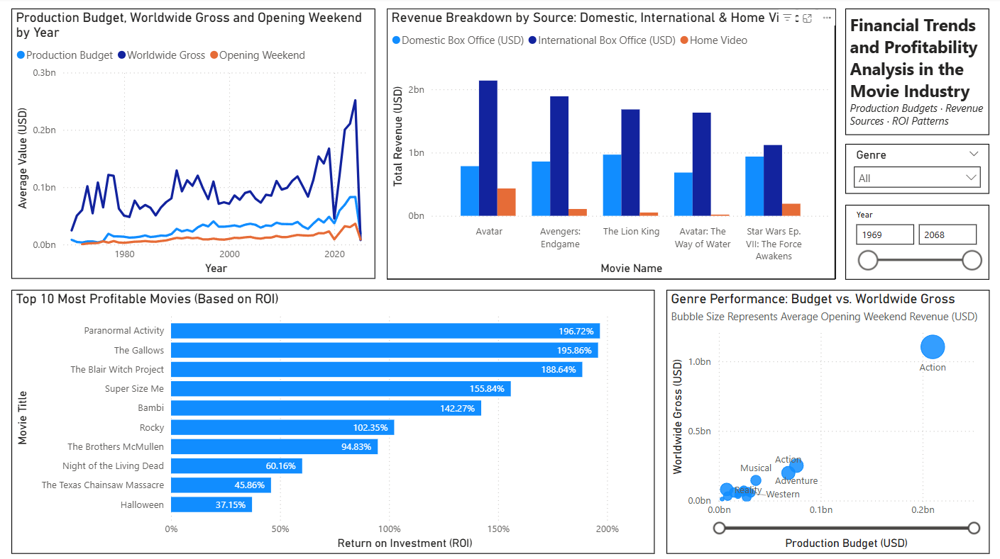
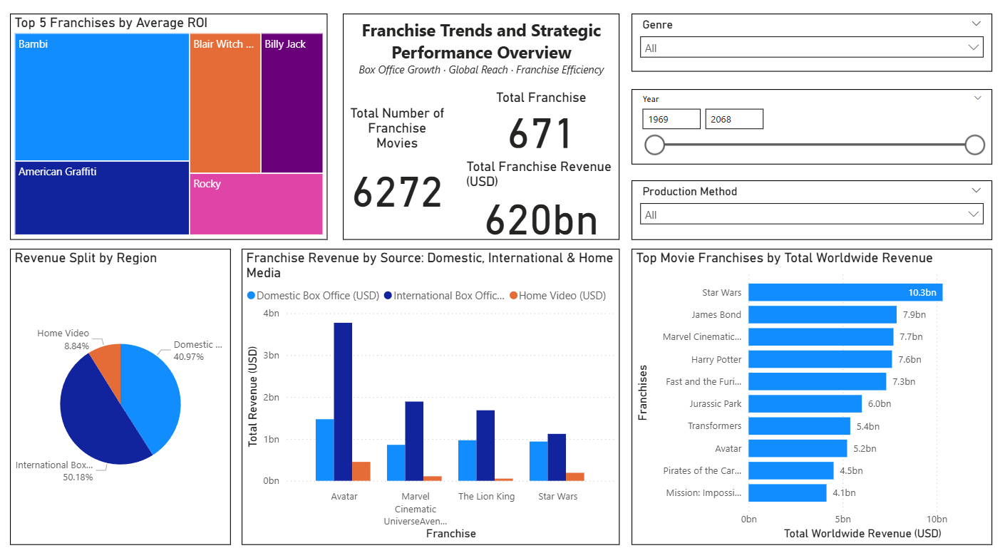

# Movie Industry Performance Analysis

This project analyzes the **financial and strategic performance of the movie industry** using a combination of **Power BI dashboards, Excel analysis, and written reporting**.  
It explores trends in production budgets, revenues, ROI, and franchise performance to provide **actionable insights for studios and stakeholders**.

---

## 📊 Project Overview
- **Objective:** Identify key drivers of profitability and growth in the global movie industry.  
- **Dataset:** Financial and categorical details for movies, including budgets, domestic & international revenue, ROI, genres, and franchises.  
- **Techniques Used:**  
  - Data preparation (CSV/Excel)  
  - ROI & profitability analysis (Excel)  
  - Interactive dashboards (Power BI)  
  - Business reporting (PDF with recommendations)  

---

## 📈 Key Insights
- **Budget vs Gross:** Higher budgets yield higher gross revenue but diminishing ROI.  
- **ROI Leaders:** Low-budget films (e.g., *Paranormal Activity*, *The Blair Witch Project*) achieved ROI above 150%.  
- **Revenue Sources:** International markets contribute ~50% of revenue, highlighting their importance for box office success.  
- **Franchises:** *Star Wars*, *Marvel Cinematic Universe*, *Harry Potter*, and *Fast & Furious* dominate worldwide revenues.  
- **Genre Trends:** Action/Adventure generate the largest grosses, while Horror/Comedy lead ROI efficiency.  

---

## 📑 Reports & Deliverables
- [Excel Analysis (XLSX)](analysis/Movie_Industry_Analysis.xlsx)  
- [Power BI Dashboard (PBIX)](dashboard/Movie_Industry_Dashboard.pbix)  
- [Final Report (PDF)](reports/Movie_Industry_Report.pdf)  

---

## 📊 Sample Visualizations

### Financial Performance Dashboard

### Franchise Performance Dashboard

---

## 🛠️ Tools Used
- **Power BI** – Dashboard design & insights  
- **Microsoft Excel** – ROI analysis, profitability calculations  
- **CSV Dataset** – Raw data exploration  
- **PDF Report** – Final business recommendations  

---

## 📚 Key Learnings
- Gained experience in combining **financial metrics (ROI, gross, budgets)** with **business storytelling**.  
- Strengthened skills in **data preparation and analysis** using CSV and Excel.  
- Built **interactive Power BI dashboards** to visualize trends in budgets, revenues, ROI, and franchises.  
- Learned how to apply **visualization best practices** (filters, interactivity, labeling) for clearer insights.  
- Improved ability to translate data into **meaningful insights for business decision making**.  

---

## 📜 License
This project is released under the **MIT License**.
